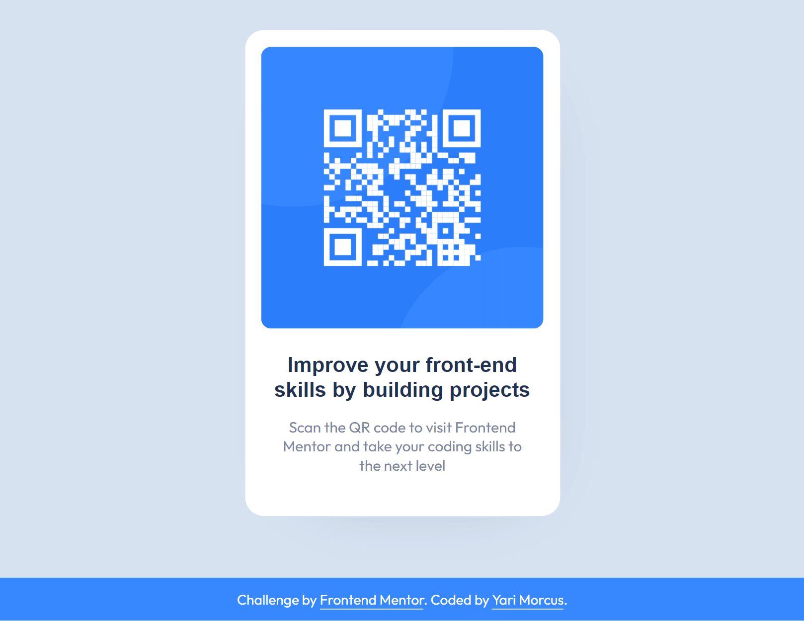

# Frontend Mentor - QR code component solution

This is a solution to the [QR code component challenge on Frontend Mentor](https://www.frontendmentor.io/challenges/qr-code-component-iux_sIO_H). Frontend Mentor challenges help you improve your coding skills by building realistic projects. 

## Table of contents

- [Overview](#overview)
  - [The challenge](#the-challenge)
  - [Links](#links)
- [My process](#my-process)
  - [Built with](#built-with)
  - [What I learned](#what-i-learned)
    - [Things I should keep in mind](#things-i-should-keep-in-mind)
  - [Continued development](#continued-development)
  - [Useful resources](#useful-resources)
- [Author](#author)

## Overview

### The challenge

To build the QR code component according to the given designs, and make it look as close as possible.

### Links

- Solution URL: [Open GitHub repository](https://github.com/YariMorcus/qr-code-component)
- Live Site URL: [open GitHub Pages of repository](https://yarimorcus.github.io/qr-code-component)

## Pure JavaScript library solution (QRious)

I created an alternative solution to the raster image that has been used for the QR code (supplied by Frontend Mentor).

This solution generates the QR code with a JavaScript library called QRious, created by neocotic). All the files that are necessary for this solution can be found in the folder named 'qrcode-generated-by-js'.
Copy and paste all the files in this folder in the root of your project, replacing the already existing files.

The QRious pure JavaScript library can be found [in this GitHub repository](https://github.com/neocotic/qrious).
## My process

### Built with

- Semantic HTML5 markup
- CSS
- Flexbox
- Mobile-first workflow
- [Node.js](https://nextjs.org/) - Open source and multiplatform JavaScript runtime environment
- [NPM](https://www.npmjs.com/) - Package Manager for Node JavaScript platform
- [Browsersync](https://browsersync.io) - Synchronous browser testing (in collaboration with Gulp)
- [Gulp](https://gulpjs.com) - Build tool used as workflow automation tool
- [Sass](https://sass-lang.com/) - CSS Preprocessor (in collaboration with Gulp)
- [GitHub](https://github.com/YariMorcus/interactive-rating-component) - Technological platform based on Git
- [Git](https://git-scm.com/) - Free and open source distributed version control system

### What I learned

1. Always use semantic compliants-standard HTML
2. To spend time looking at the details of the given designs, to create the application as close as possible to it
3. How Sass variables work (the basics for now)
4. To always keep my CSS organized

#### Things I should keep in mind

1. Continuously test the accessibility.  
    I only tested after I wrote my HTML(5), but not during and after I was done with writing CSS.  
    This is something I should keep in mind the next time.

2. Get both the HTML and CSS through a validation service after I finished writing HTML and CSS.  
    I realized myself this when writing the README.md, while this is something I should have done first.

### Continued development

The way I want to continue to develop myself is by focusing on laying out a proper foundation of HTML, CSS, and JavaScript.
This is so I can build quality websites for clients, by just using the core languages of the Web.
At the present, I am working on the above things by going through (interactive) articles on the MDN Web Docs (see chapter [Useful resources](#useful-resources)).

Another way I want to improve my knowledge of these subjects is to do more challenges that [Frontend Mentor](https://www.frontendmentor.io/challenges) is offering, starting at the lowest level and building that up to the more advanced ones.

Besides the above, I want to continue to develop myself by using several tools more often to improve my workflow, and spend less time doing things that can be automated.  

A few tools that I will start using more often are:
1. Gulp
2. Git
3. GitHub

_I will learn the above-mentioned points in-between but do not want to focus myself too much on those at the moment._

As soon as I am capable of creating quality websites from the core languages of the Web, I will start to learn JavaScript libraries and frameworks. Both of these change over time, so I do not want to spend my time on those before I have a solid understanding of prior mentioned languages.

### Useful resources

- [Font Squirrel Webfont Generator](https://www.fontsquirrel.com/tools/webfont-generator) - Has been used to convert the downloaded font files to woff and woff2 (most recent font formats, supported in all major browsers), and generate the corresponding `@font-face` css ruleset
- [Frontend Mentor - Interactive rating component challenge](https://www.frontendmentor.io/challenges/interactive-rating-component-koxpeBUmI) 

## Author

- LinkedIn - [Yari Morcus](https://www.linkedin.com/in/yarimorcus/)
- Frontend Mentor - [@YariMorcus](https://www.frontendmentor.io/profile/YariMorcus)